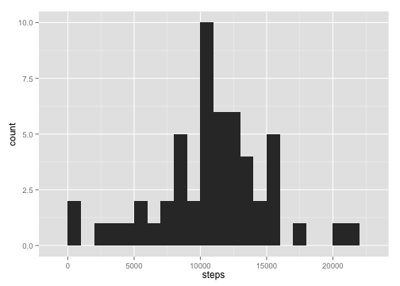
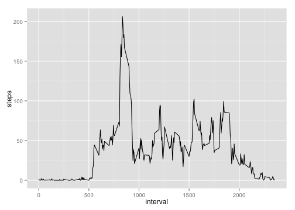
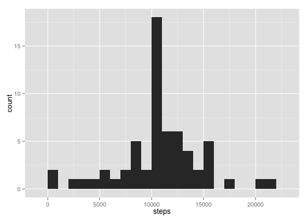
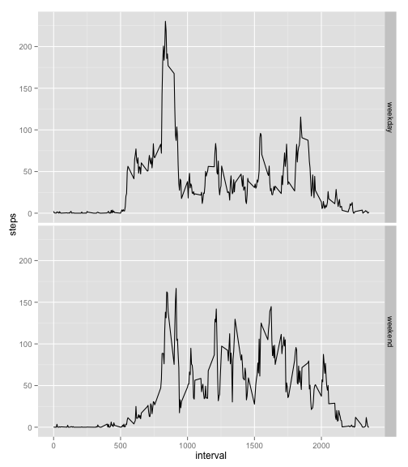

## Loading and preprocessing the data

The following code load the data file into `activity` variable,
converting the type of "date" column from `character` to `Date`. 


```r
activity <- read.csv("activity.csv", stringsAsFactors = FALSE)
activity$date <- as.Date(activity$date, format = "%Y-%m-%d")
```

## What is mean total number of steps taken per day?

To make a histogram of the total number of steps taken each day,
we first group the data by date with removeing `NA`s.


```r
activity.complete <- na.omit(activity)
step.date <- aggregate(steps ~ date, activity.complete, sum)
```

A histogram is given by the following:


```r
library(ggplot2)
qplot(x = steps, data = step.date, geom = "histogram", binwidth = 1000)
```

 

The mean and median total number of steps taken per day are calculated as follows:


```r
step.date.mean = mean(step.date$steps)
step.date.median = median(step.date$steps)
```

Thus,
 - mean total daily steps is 10766,
 - median total daily steps is 10765.

## What is the average daily activity pattern?

To make a time series plot, let us group the data by the interval
and average it over all days.


```r
step.interval <- aggregate(steps ~ interval, activity.complete, mean)
qplot(interval, steps, data = step.interval, geom = "line")
```

 

The interval when the maximum number of steps are taken is given by

```r
peek <- step.interval$interval[which.max(step.interval$steps)]
```
and results in ``835``.
## Imputing missing values

The total number of missing values in the dataset is calculated as

```r
missing.index <- is.na(activity)
missing.number <- sum(missing.index)
```

The total number of missing values is ``2304``.

Next, we fill the missing data with the mean for that 5-minute interval.

```r
missing.interval <- activity[missing.index,]$interval
missing.mean.index <- match(missing.interval, step.interval$interval)
activity.filled <- activity
activity.filled[missing.index,]$steps <- 
    step.interval[missing.mean.index,]$steps
```

`activity.filled` is a dataset that is equal to the original dataset but with the missing data filled in.

A histogram for filled dataset is given as follows:

```r
step.date.filled <- aggregate(steps ~ date, activity.filled, sum)
qplot(x = steps, data = step.date.filled, geom = "histogram", binwidth = 1000)
```

 

The mean and median total number of steps taken per day for this filled data is calculated like previous data.


```r
step.date.filled.mean = mean(step.date.filled$steps)
step.date.filled.median = median(step.date.filled$steps)
```

- mean total daily steps with imputed data is 
 10766,
- median total daily steps with imputed data is
 10766.

Imputing the data this way did not affect average and median.

Putting average into missing data has a impact 
that increases the count near the mean and median bins,
but the distribution was not affected as a whole.

## Are there differences in activity patterns between weekdays and weekends?

Let's add a new factor variable in the dataset with two levels –
“weekday” and “weekend”.


```r
ignored <- Sys.setlocale("LC_TIME", "C")
activity.filled["day"] <- 
    factor(weekdays(activity.filled$date) %in% c("Saturday", "Sunday"),
           labels = c("weekday", "weekend"))
```

A time series plot for weekday and weekend looks like the following:


```r
step.day <- aggregate(steps ~ interval + day, data = activity.filled, mean)
ggplot(step.day, aes(interval, steps)) + geom_line() + facet_grid(day ~ .)
```

 
